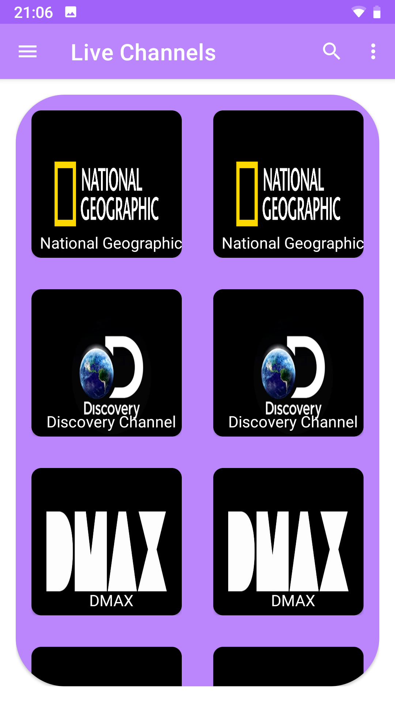
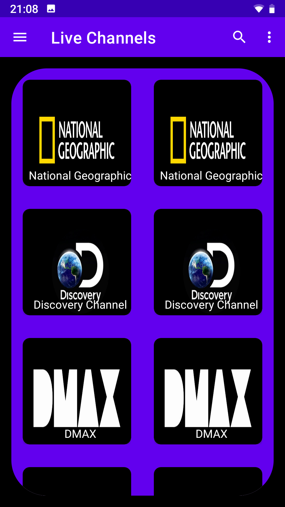
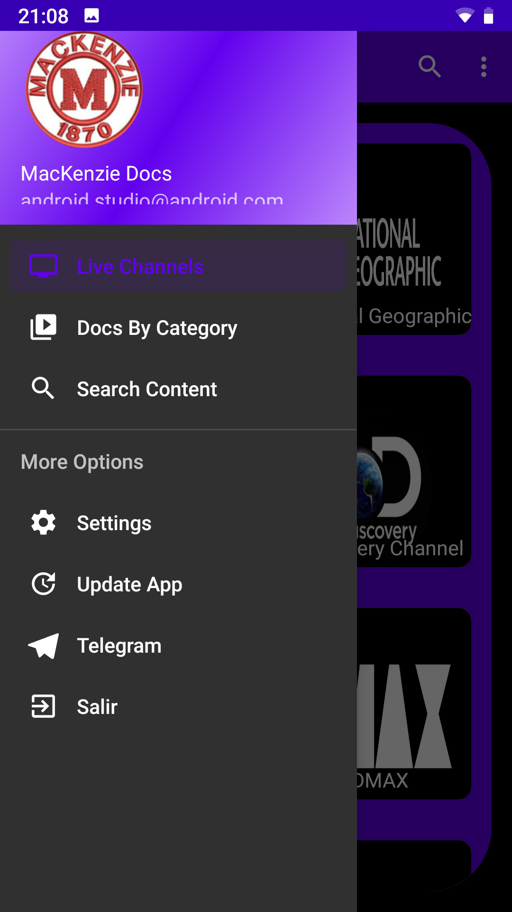
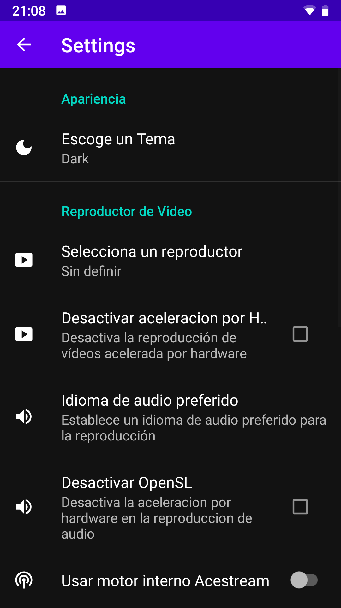
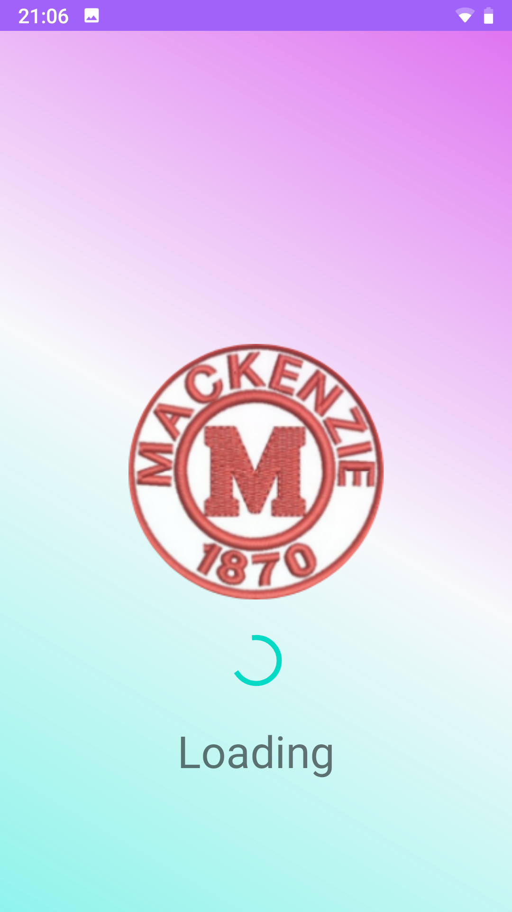
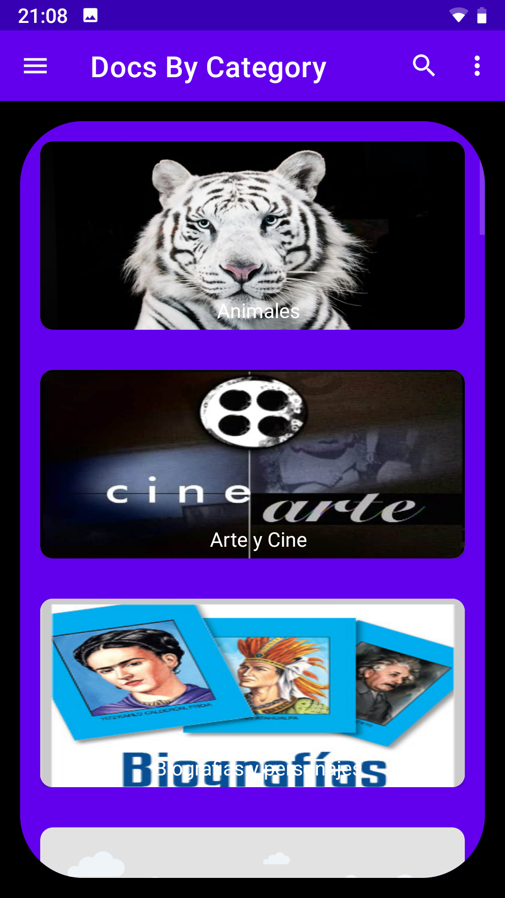

# Documentalia

It is an app that allows the viewing of channels and live broadcasts (live Streams) and any type of videos (Streams)

|  |  |  |
| ---------------------------------------------- | -------------------------------------------- | ------------------------------------------- |
|  |  |  |
| ---------------------------------------------- | -------------------------------------------- | ------------------------------------------- |
|  |  |  |

## Getting Started 🚀

### Setup development environment 📋

* [Android Studio](https://developer.android.com/studio)

* [Android SDK Tools](https://developer.android.com/studio#Other)


### Build & Run the application 🔧

1. Get the source code.

```
git clone --recursive https://github.com/LuisMackenzie/Documentalia.git
```

### Notice

This project does not include copyrighted live broadcasts of any kind. It is a project with educational purposes. The live broadcasts that have been used are copyright free.


## Built with 🛠️

* [Android Studio](https://developer.android.com/studio) - The Android framework recomended by Google
* [Gradle](https://gradle.org/) - Gradle, is a tool and dependency manager that allows open source compilation automation, which is focused on flexibility and performance
* [Glide](https://bumptech.github.io/glide/) - Glide is media management and image loading framework for Android
* [Picasso](https://square.github.io/picasso/) - Picasso allows for hassle-free image loading in your application
* [ExoPlayer](https://exoplayer.dev/) - ExoPlayer is an application level media player for Android. It provides an alternative to Android’s MediaPlayer API for playing audio and video both locally and over the Internet
* [Gson](https://github.com/google/gson) - Library that can be used to convert Java Objects into their JSON representation.
* [Volley](https://github.com/google/volley) - Volley is an HTTP library that facilitates and speeds up the use of networks in Android apps

## Autors ✒️

* **Luis Baez** - *Initial work* - [My Github](https://github.com/LuisMackenzie)

<!--
## Licencia 📄

Este proyecto está bajo la Licencia (Tu Licencia) - mira el archivo [LICENSE.md](LICENSE.md) para detalles

## Expresiones de Gratitud 🎁

* Comenta a otros sobre este proyecto 📢
* Invita una cerveza 🍺 o un café ☕ a alguien del equipo. 
* Da las gracias públicamente 🤓.
* etc.  -->


---
⌨️ with ❤️ by [Luis](https://github.com/LuisMackenzie) 😊
